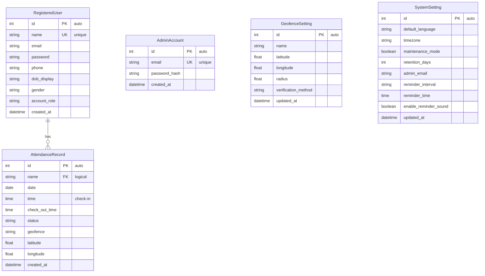

# Smart Attendance System Using Face Recognition
### Final Semester Project Report

---

## Chapter I: Introduction

### 1.1 Brief Background of the Organization

This project is developed as part of an academic final semester submission at an engineering/computer science institution. The project was conceived to address modern attendance management challenges faced by educational institutions and corporate organizations. Traditional attendance methods — such as manual roll calls, sign-in registers, or card-based systems — are prone to human error, proxy attendance, and inefficiency. With the growing adoption of biometric technologies and web-based platforms, there is a strong demand for a reliable, automated, and intelligent attendance solution. This system was designed and developed to solve those exact problems using state-of-the-art deep learning–based face recognition technology, GPS-based geofencing, and a full-stack web application.

---

### 1.2 Title of the Project

**Smart Attendance System Using Face Recognition**

---

### 1.3 Project Definition

The **Smart Attendance System** is a full-stack web application that automates employee/student attendance recording through real-time webcam-based facial recognition. The system leverages **MTCNN (Multi-task Cascaded Convolutional Networks)** for face detection and **FaceNet (InceptionResnetV1 pretrained on VGGFace2)** for face recognition and identity verification.

Users can self-register using a webcam that captures multiple facial angles (left, right, up, down), and subsequently mark their check-in and check-out attendance using live webcam scans. A GPS-based **geofencing mechanism** ensures attendance can only be marked within an admin-defined physical boundary (radius from a location center). The backend is built on **Django 5.x**, the database is **SQLite**, and the frontend comprises multiple custom HTML/CSS/JavaScript pages. An **Admin Portal** provides real-time insights including attendance dashboards with metrics, maps, user management, geofence configuration, and system settings.

---

### 1.4 Existing System

The existing traditional attendance systems suffer from several major drawbacks:

1. **Manual Roll Call / Paper-based Systems:** Time-consuming, error-prone, and subject to manipulation. Proxy attendance (one student marking for another) is uncontrollable.
2. **RFID/Smart Card Systems:** Require physical cards which can be shared among individuals, enabling proxy attendance. Cards can also be lost or forgotten.
3. **Password/PIN-based Systems:** Credentials can be shared, and these systems offer no proof of physical presence.
4. **Basic Biometric (Fingerprint) Systems:** Require specialized hardware at every entry point. High installation cost, and hygiene concerns exist.
5. **Spreadsheet/Excel-based tracking:** Manual entry is tedious and error-prone. No real-time reporting or geofencing validation.

**Limitations of the Existing System:**
- No prevention of proxy attendance
- No real-time monitoring or analytics
- No location-based attendance validation
- Difficult to scale
- No centralized admin control
- No automated reporting

---

### 1.5 Proposed System

The proposed **Smart Attendance System Using Face Recognition** overcomes all the limitations of the existing system:

1. **Face Recognition-based Identity Verification:** Uses MTCNN + FaceNet deep learning models. Each person's face embedding is unique — proxy attendance is eliminated.
2. **Geofencing Enforcement:** Uses Windows GPS API (with IP geolocation as fallback) and the Haversine formula to compute distance. Attendance can only be marked within a configurable radius set by the admin through a dedicated admin panel.
3. **Multi-Angle Biometric Registration:** During registration, 4 facial angles (left, right, up, down) are captured to ensure robust recognition from different orientations and lighting conditions.
4. **Web-based Dashboard:** Employees can view their recent attendance history, weekly hours worked, monthly attendance calendar, and personal analytics from any browser.
5. **Admin Portal:** Admins can view live attendance metrics, manage geofence zones on an interactive map, enroll new users (manually or with biometric data), manage system settings, and monitor all user activity.
6. **Duplicate Prevention:** A session-level guard prevents a user from double-checking in on the same day.
7. **Check-in / Check-out:** Each day's record includes both check-in time and check-out time, allowing total work hours to be computed automatically.

**Advantages of the Proposed System:**
- Completely automated — no human intervention required
- Eliminates proxy attendance through biometric verification
- Location validation via GPS geofencing
- Real-time web dashboard with live metrics
- Centralized admin control panel
- Analytics with trend graphs, monthly summaries, and punctuality scores
- Light-weight deployment — runs entirely on a PC with a webcam

---

### 1.6 Objectives

The key objectives of this project are:

1. To design and develop a face recognition–based attendance system using deep learning.
2. To capture and store multi-angle facial embeddings for robust user registration.
3. To implement real-time face detection and recognition using MTCNN and FaceNet during check-in/check-out.
4. To enforce GPS-based geofencing so that attendance is restricted to a designated physical zone.
5. To build a secure, session-based user authentication system with both employee and admin roles.
6. To provide a user-friendly, responsive web frontend for employees (dashboard, analytics, profile) and administrators.
7. To implement a full-featured admin portal with real-time metrics, user management, geofence editing, and system configuration.
8. To store all attendance records securely in a relational database (SQLite) via Django ORM.
9. To compute analytics including attendance rate, punctuality score, total hours worked, and streak tracking.
10. To ensure scalability and ease of deployment for small-to-medium organizations.

---

### 1.7 Hardware and Software Used in the Project

#### Hardware Requirements
| Component | Minimum Specification |
|---|---|
| Processor | Intel Core i5 (7th Gen+) or equivalent |
| RAM | 8 GB (16 GB recommended for PyTorch models) |
| Storage | 10 GB free disk space |
| Webcam | 720p or higher (built-in or external USB) |
| GPU (Optional) | NVIDIA CUDA-capable GPU for faster inference |
| Operating System | Windows 10/11 (64-bit) |
| Internet Connection | Required for GPS IP-fallback & initial model download |

#### Software Requirements
| Software / Library | Version / Details |
|---|---|
| Programming Language | Python 3.10+ |
| Web Framework | Django 5.x |
| Face Detection | facenet-pytorch (MTCNN) |
| Face Recognition | facenet-pytorch (InceptionResnetV1, VGGFace2 pretrained) |
| Deep Learning Framework | PyTorch (CPU/CUDA) |
| Image Processing | OpenCV (opencv-python), Pillow |
| Numerical Computing | NumPy ≥ 2.0 |
| Geolocation (Windows) | winrt-Windows.Devices.Geolocation, winrt-Windows.Foundation |
| Database | SQLite 3 (via Django ORM) |
| Environment Config | python-dotenv |
| Frontend | HTML5, CSS3, JavaScript, Phosphor Icons, Chart.js, Leaflet.js |
| IDE / Editor | Visual Studio Code |
| Version Control | Git |

---

## Chapter II: System Analysis

### 2.1 Introduction

System analysis is the process of investigating a problem domain and defining the approach to building a solution. In this project, the system analysis phase involved studying the shortcomings of existing attendance management methods, identifying the needs of users (both employees and administrators), and designing an information system that would meet those needs efficiently. The analysis helped define the system's data flow, database entities, feasibility constraints, and functional/non-functional requirements.

The Smart Attendance System processes three primary workflows:
1. **User Registration** — Capturing multi-angle facial biometrics and storing user profile information.
2. **Attendance Marking** — Live webcam-based face scan, geolocation check, and database record creation.
3. **Reporting and Management** — Dashboard display of attendance history, analytics computation, and admin-level management.

---

### 2.2 Feasibility Study

#### 2.21 Introduction

A feasibility study determines whether the proposed system is practical, affordable, and realistically achievable within the given constraints of time, budget, and technology. The feasibility study for this project was evaluated across three dimensions: Economic, Technical, and Behavioral.

#### 2.22 Economic Feasibility

The Smart Attendance System is highly economically feasible for the following reasons:

- **Zero-cost core stack:** Python, Django, OpenCV, and PyTorch are all open-source and free to use.
- **No specialized hardware required:** The system works with any standard PC and a built-in or USB webcam. There is no need to purchase biometric terminals at every entry point.
- **Low operational cost:** The system runs entirely locally (or on a low-cost server) without requiring cloud subscriptions.
- **Scalable without hardware investment:** Adding more employees only requires registering new faces — no additional hardware per user.
- **Comparison to alternatives:** RFID-based systems require card readers (~₹5,000–₹15,000 each) plus cards per user. Fingerprint systems require similar hardware. The proposed system only needs a webcam (~₹500–₹2,000) and runs on existing computers.

**Conclusion:** The system is economically viable and provides significant cost savings over hardware-based biometric systems.

#### 2.23 Technical Feasibility

The system is technically feasible based on the following:

- **Proven and stable frameworks:** Django (Version 5.x) is a mature, battle-tested web framework. PyTorch and facenet-pytorch are industry-standard deep learning libraries.
- **Established face recognition pipeline:** MTCNN (Multi-task CNN for face detection) and FaceNet (InceptionResnetV1, pretrained on VGGFace2 with 3.3M images) achieve high accuracy in uncontrolled environments.
- **GPU-Optional Architecture:** The system is designed to run on CPU (using PyTorch's `torch.device('cpu')`), while CUDA GPU acceleration is supported seamlessly for faster inference.
- **Embedding cache:** The system uses a `_embeddings_cache.pt` file to avoid re-computing face embeddings on every startup, drastically reducing load time.
- **Geolocation support:** The Windows Runtime (WinRT) Geolocation API provides precise GPS coordinates. An IP-based geolocation fallback (`ip-api.com`) is implemented for environments where GPS access is restricted.
- **Web deployment:** Django's built-in development server or any WSGI server (e.g., Gunicorn) can host the application.

**Conclusion:** All required technologies are well-documented, stable, and available. The system is technically feasible.

#### 2.24 Behavioral Feasibility

The system is behaviorally feasible because:

- **Ease of use:** The employee-facing interface requires only biometric scanning (look at the webcam) — no passwords, no badges, no manual input.
- **Familiar web UI:** The entire system runs in a web browser with an intuitive, modern interface, accessible to non-technical users.
- **Guided registration:** During biometric registration, on-screen instructions guide the user through each required facial angle. The system provides real-time feedback ("Hold still...", "Detected: LEFT").
- **Minimal behavioral change:** Employees simply walk up to the webcam and look at it — replacing the act of signing a paper or tapping a card.
- **Admin empowerment:** The admin panel is designed with a clear sidebar navigation, making it easy for administrators to perform tasks like editing geofences, enrolling users, or checking analytics without technical knowledge.

**Conclusion:** The system presents a very low behavioral barrier and is highly acceptable to end users.

---

### 2.4 Software Requirement Gathering and Specification

#### Functional Requirements

| Req. ID | Requirement |
|---|---|
| FR-01 | The system shall allow new employees/students to self-register by capturing multiple facial angles via webcam. |
| FR-02 | The system shall allow admins to manually enroll users with uploaded biometric images. |
| FR-03 | The system shall authenticate users via face recognition (MTCNN + FaceNet) during sign-in. |
| FR-04 | The system shall record attendance (check-in time, location) only if the user is within the admin-defined geofence radius. |
| FR-05 | The system shall allow users to check out and record their check-out time. |
| FR-06 | The system shall prevent duplicate check-in records for the same user on the same day. |
| FR-07 | The system shall display a personal dashboard with recent activity, weekly hours, and attendance calendar. |
| FR-08 | The system shall provide a personal analytics page with attendance rate, punctuality score, trend graphs, and monthly summary. |
| FR-09 | The system shall allow users to view and edit their profile (name, email, phone, DOB, gender, photo). |
| FR-10 | The system shall provide an admin dashboard with system-wide metrics (attendance %, late arrivals, active users, new registrations). |
| FR-11 | The system shall allow admins to configure the geofence (latitude, longitude, radius, verification method) via the admin panel. |
| FR-12 | The system shall display all registered users with pagination in the admin user management panel. |
| FR-13 | The system shall allow admin to configure system settings (timezone, language, maintenance mode, retention days, admin email, reminders). |
| FR-14 | The system shall authenticate admin login via email and hashed password. |
| FR-15 | The system shall maintain session-based authentication for both employee and admin roles. |

#### Non-Functional Requirements

| Req. ID | Requirement |
|---|---|
| NFR-01 | **Performance:** Face recognition inference shall complete within 3 seconds on a CPU. |
| NFR-02 | **Accuracy:** The system shall correctly identify registered users with a Euclidean distance threshold of ≤ 0.6. |
| NFR-03 | **Security:** Passwords shall be stored as hashed values using Django's `make_password` function. |
| NFR-04 | **Reliability:** The system shall fall back to IP-based geolocation if GPS is unavailable. |
| NFR-05 | **Usability:** The interface shall be operable by non-technical users without training. |
| NFR-06 | **Scalability:** Adding a new user shall only require registering biometric images — no code changes. |
| NFR-07 | **Data Integrity:** All attendance records shall be stored with timestamps in the Django-managed SQLite database. |
| NFR-08 | **Portability:** The system shall run on any Windows machine with Python installed. |

---

### 2.5 Structured Analysis and Design (DFD / UML)

#### 2.51 Data Dictionary

| Data Element | Type | Description |
|---|---|---|
| `name` | CharField (max 255) | Full display name of the registered user |
| `email` | EmailField | User's email address |
| `password` | CharField | Hashed password for manual login |
| `phone` | CharField | Contact phone number |
| `dob_display` | CharField | Date of birth (display string) |
| `gender` | CharField | User's gender |
| `account_role` | CharField | Role: `employee`, `student`, or `teacher` |
| `created_at` | DateTimeField | Timestamp of user registration |
| `date` | DateField | Date of attendance record |
| `time` | TimeField | Check-in time |
| `check_out_time` | TimeField | Check-out time |
| `status` | CharField | `present` or `out_of_radius` |
| `geofence` | CharField | Name of geofence zone |
| `latitude` | FloatField | User's latitude at time of attendance |
| `longitude` | FloatField | User's longitude at time of attendance |
| `center_lat` | FloatField | Admin-configured geofence center latitude |
| `center_lon` | FloatField | Admin-configured geofence center longitude |
| `radius` | FloatField | Geofence radius in meters |
| `verification_method` | CharField | Geofence method: `GPS Only`, etc. |
| `default_language` | CharField | System UI language (e.g., `English`) |
| `timezone` | CharField | System timezone (e.g., `Asia/Kolkata`) |
| `maintenance_mode` | BooleanField | Whether system is in maintenance mode |
| `retention_days` | IntegerField | Days data is retained before cleanup |
| `admin_email` | EmailField | Admin notification email |
| `reminder_time` | TimeField | Daily reminder notification time |

#### 2.52 ER Diagram

The system has the following entity relationships:

**Relationships:**
- A `RegisteredUser` can have **many** `AttendanceRecord` entries (1:N, linked via name).
- `GeofenceSetting` is a *singleton-style* configuration table (one active record).
- `SystemSetting` is a singleton configuration table for global system preferences.
- `AdminAccount` is separate from `RegisteredUser` — it manages admin-level access.

#### 2.53 Database Design

The system uses **SQLite 3** as its relational database, managed through Django's ORM. The database file is `db.sqlite3` located in the project root. Django migrations handle all schema creation and alterations.

**Tables and Key Columns:**

**Table: `attendance_registereduser`**
| Column | Type | Constraints |
|---|---|---|
| id | INTEGER | PRIMARY KEY AUTOINCREMENT |
| name | VARCHAR(255) | UNIQUE, NOT NULL |
| email | VARCHAR(254) | |
| password | VARCHAR(128) | |
| phone | VARCHAR(50) | |
| dob_display | VARCHAR(64) | |
| gender | VARCHAR(16) | |
| account_role | VARCHAR(16) | DEFAULT 'employee' |
| created_at | DATETIME | AUTO |

**Table: `attendance_attendancerecord`**
| Column | Type | Constraints |
|---|---|---|
| id | INTEGER | PRIMARY KEY AUTOINCREMENT |
| name | VARCHAR(255) | NOT NULL |
| date | DATE | NOT NULL |
| time | TIME | NULLABLE |
| check_out_time | TIME | NULLABLE |
| status | VARCHAR(32) | DEFAULT 'present' |
| geofence | VARCHAR(255) | DEFAULT 'Main Entrance' |
| latitude | FLOAT | NULLABLE |
| longitude | FLOAT | NULLABLE |
| created_at | DATETIME | AUTO |

**Table: `attendance_geofencesetting`**
| Column | Type | Constraints |
|---|---|---|
| id | INTEGER | PRIMARY KEY AUTOINCREMENT |
| name | VARCHAR(255) | DEFAULT 'Main Site' |
| latitude | FLOAT | DEFAULT 26.1180 |
| longitude | FLOAT | DEFAULT 91.8136 |
| radius | FLOAT | DEFAULT 500.0 |
| verification_method | VARCHAR(64) | DEFAULT 'GPS Only' |
| updated_at | DATETIME | AUTO |

**Table: `attendance_systemsetting`**
| Column | Type | Constraints |
|---|---|---|
| id | INTEGER | PRIMARY KEY AUTOINCREMENT |
| default_language | VARCHAR(255) | DEFAULT 'English' |
| timezone | VARCHAR(255) | DEFAULT 'Asia/Kolkata' |
| maintenance_mode | BOOLEAN | DEFAULT FALSE |
| retention_days | INTEGER | DEFAULT 90 |
| admin_email | VARCHAR(254) | DEFAULT 'admin@gmail.com' |
| reminder_interval | VARCHAR(255) | DEFAULT 'Daily Reminders' |
| reminder_time | TIME | DEFAULT '08:30' |
| enable_reminder_sound | BOOLEAN | DEFAULT TRUE |

---

## Chapter III: Front End Design

### 3.1 Input Design

Input design refers to the design of screens and forms through which data is entered into the system. The following key input interfaces exist in the Smart Attendance System:

#### a) Registration Page (`registration.html`)
- **Inputs:** Full Name, Email, Password
- **Biometric Input:** Webcam-based multi-angle capture interface. The user follows on-screen prompts (Turn LEFT, Turn RIGHT, Move UP, Move DOWN). MTCNN detects the face in real-time and auto-captures when the correct pose is held stable for 10+ frames.
- **Design Features:** High-contrast dark theme with a centered camera feed, real-time pose detection overlay, animated capture progress.

#### b) Sign-In Page (`signin.html`)
- **Inputs:** Webcam-based face scan (no password required for biometric sign-in).
- **Alternative:** Manual login form (`manual_login.html`) with Email and Password fields.
- **Design Features:** Face-mesh style overlay on camera feed. JavaScript `getUserMedia` API streams live webcam feed; frames are sent to the backend via `fetch` (base64-encoded JPEG).

#### c) Attendance Scanner Page (`scanner.html`)
- **Inputs:** Webcam-based live scan for check-in and check-out.
- **Design Features:** Animated scan ring with green highlight on recognition. Duplicate check-in prevention — if the user has already checked in today, they are redirected to check-out mode.

#### d) Admin Geofencing Page (`admin_geofencing.html`)
- **Inputs:** Latitude, Longitude, Radius (meters), Verification Method (dropdown).
- **Map Input:** Interactive Leaflet.js map where the admin can click to select coordinates visually.
- **Design Features:** Dark-themed admin sidebar, real-time map update on coordinate change.

#### e) Admin User Enrollment Page (`admin_user_enrollment.html`)
- **Inputs:** Full Name, Email, Password, and five biometric angle images (Front View, Right Profile, Left Profile, Upward Angle, Downward Angle) via file upload fields.
- **Design Features:** Drag-and-drop styled file inputs with image preview capability.

#### f) Admin System Settings Page (`admin_system_settings.html`)
- **Inputs:** Default Language (dropdown), Timezone (dropdown), Maintenance Mode (toggle), Retention Days (number input), Admin Email, Reminder Interval (dropdown), Reminder Time (time input), Enable Reminder Sound (checkbox).

#### g) Profile Edit Page (`profile_edit.html`)
- **Inputs:** Full Name, Email, Phone, Date of Birth (date picker), Gender (dropdown), Profile Photo (file upload).
- **Design:** Side-by-side layout with current profile summary on left, editable form on right.

---

### 3.2 Output Design

Output design refers to how information is displayed to the user as a result of system processing.

#### a) Employee Dashboard (`dashboard.html`)
- **Outputs:**
  - Greeting with user name and profile photo
  - **Weekly Hours Progress Bar** — shows hours worked vs. 40-hour goal
  - **Attendance Calendar** — current month view; present days highlighted in green, today highlighted in primary color
  - **Recent Activity Feed** — last 3 check-in/check-out events with timestamps and durations
  - **Quick Action Buttons** — Check In / Check Out scanner triggers

#### b) Attendance Success Page (`attendance_success.html`)
- **Outputs:** Confirmation of successful attendance marking with the recorded time and date. Displayed after each successful check-in or check-out.

#### c) Analytics Page (`analytics.html`)
- **Outputs:**
  - **Summary Cards:** Attendance Rate (%), Total Hours Worked, Leaves Taken, Punctuality Score
  - **Trend Graph** (Chart.js line chart): Daily check-in times over the selected date range
  - **Monthly Summary Table:** Present, Absent, Late counts per month; rendered as a bar chart
  - **Time Distribution Doughnut Chart:** Early / On-Time / Late arrival percentages
  - **Performance Insights:** Most consistent month, longest streak, efficiency score, average check-in time
  - **Recent Activity List:** Last 10 attendance events with icons and timestamps

#### d) Admin Dashboard (`admin_dashboard.html`)
- **Outputs:**
  - **KPI Cards:** Total Users, Attendance %, Late Arrivals count, Active Now, New Registrations, Peak Activity time, Avg. Session duration
  - **Delta Indicators:** Period-over-period change percentage for KPIs
  - **Live Attendance Map** (Leaflet.js): Markers showing each employee's GPS check-in location for the selected date range; color-coded (green = present, amber = out of radius)
  - **Geofence Circle Overlay** on the map, centered on the admin-configured location
  - **Recent Logs Table:** Name, Check-In Time, Check-Out Time, Location, Status
  - **Date Range Selector** for filtering all metrics

#### e) Admin User Management Page (`admin_user_management.html`)
- **Outputs:** Paginated table of all registered users; displays photo, name, formatted Employee ID, email, role, status badge, and action buttons.

#### f) Profile Page (`profile.html`)
- **Outputs:** Profile photo, full name, Employee ID, role title, personal details (email, phone, DOB, gender), account role description.

---

## Chapter IV: Testing

### 4.1 Unit Testing

Unit testing focuses on verifying the correctness of individual components of the system in isolation. The Smart Attendance System's components were tested systematically through the following test categories.

---

#### 4.11 Verification Testing

Verification testing ensures that the system is built correctly — that the implementation matches the design specifications.

| Test Case | Component Tested | Expected Result | Actual Result |
|---|---|---|---|
| VC-01 | `AttendanceSystem.__init__` | MTCNN and FaceNet models load successfully on CPU | Pass |
| VC-02 | `load_database()` | Face embeddings loaded from `media/` directory into `embeddings_db` | Pass |
| VC-03 | `RegisteredUser` model | User saved with unique `name`, `email`, `account_role` | Pass |
| VC-04 | `AttendanceRecord` model | Record saved with date, check-in time, and `status='present'` | Pass |
| VC-05 | `GeofenceSetting` model | Default values (lat=26.1180, lon=91.8136, radius=500) created correctly | Pass |
| VC-06 | `SystemSetting` model | Default settings (language='English', timezone='Asia/Kolkata') created | Pass |
| VC-07 | Admin password hashing | `AdminAccount.set_password()` stores bcrypt hash; `check_password()` validates correctly | Pass |
| VC-08 | URL routing | All 28 URL patterns in `attendance/urls.py` resolve to correct view functions | Pass |
| VC-09 | Django template loading | All 20 HTML templates in `frontend/` directory are found and rendered by Django | Pass |
| VC-10 | Embedding cache | `_embeddings_cache.pt` is written and loaded correctly on subsequent runs | Pass |

---

#### 4.12 Validation Testing

Validation testing ensures the system does the right thing — that it meets user requirements.

| Test Case | Scenario | Expected Result | Actual Result |
|---|---|---|---|
| VL-01 | Known user scans face | System returns correct name and marks attendance | Pass |
| VL-02 | Unknown person scans face | System returns "Unknown" and rejects attendance | Pass |
| VL-03 | User checks in within geofence radius | Attendance record created with `status='present'` | Pass |
| VL-04 | User checks in outside geofence radius | Attendance blocked; `status='out_of_radius'` returned | Pass |
| VL-05 | Duplicate check-in attempt (same day) | Dashboard shows warning; user redirected to check-out mode | Pass |
| VL-06 | Admin logs in with correct credentials | Session `is_admin=True` set; admin dashboard rendered | Pass |
| VL-07 | Admin logs in with wrong credentials | Error message shown; session not created | Pass |
| VL-08 | User registers with multi-angle capture | 4 angle images (left/right/up/down) saved; database reloaded | Pass |
| VL-09 | Analytics: attendance rate calculation | Rate = (present days / working days) × 100, correct for test data | Pass |
| VL-10 | Geofence setting update via admin panel | New lat/lon/radius saved to DB; map updates on reload | Pass |
| VL-11 | Profile photo upload | Photo saved as `{slugified-name}.jpg` in `static/profile_photos/` | Pass |
| VL-12 | Punctuality score | On-time check-ins (≤9:00 AM) / total check-ins × 100, validated | Pass |

---

#### 4.13 Integration Testing

Integration testing verifies that the individual components interact correctly with each other.

| Test Case | Components Integrated | Expected Result | Actual Result |
|---|---|---|---|
| IT-01 | Face scanner → `attendance_checkin_scan` view → DB write | Scanned image processed by `AttendanceSystem.mark_attendance()`; record saved to `AttendanceRecord` | Pass |
| IT-02 | Admin geofencing page → `GeofenceSetting` model → `check_location_allowed()` | Updated radius in admin panel correctly used in geofence check during next attendance scan | Pass |
| IT-03 | Registration page (webcam) → `register_face` view → `media/` folder | Captured angle images stored in `media/{name}/` and face DB reloaded | Pass |
| IT-04 | Sign-in scan → `signin_scan` view → session creation → dashboard redirect | Face recognized → session `display_name` set → dashboard rendered with user data | Pass |
| IT-05 | Dashboard view → `AttendanceRecord` queries → template rendering | Weekly hours, calendar cells, and recent activity rendered correctly from live DB data | Pass |
| IT-06 | Admin enroll view → `RegisteredUser` creation + biometric image processing | User record created in DB; uploaded images saved to `media/` folder; face DB reloaded | Pass |
| IT-07 | Analytics view → multi-query computation → Chart.js rendering | Trend data JSON, monthly summary, time distribution sent to template and rendered as charts | Pass |
| IT-08 | `GeofenceSetting` (DB) → `_load_location_config()` in `attendance_system.py` | DB values take priority over `DEFAULT_LOCATION_CONFIG` for geofence enforcement | Pass |
| IT-09 | System settings save → `SystemSetting` DB → context processor → all templates | Saved language/timezone propagated via `attendance.context_processors.system_settings` | Pass |
| IT-10 | Logout → session flush → redirect to sign-in | `request.session.flush()` clears all session data; user redirected | Pass |

---

#### 4.14 User Acceptance Testing

User Acceptance Testing (UAT) was performed to verify that the system satisfies end-user requirements and is ready for deployment. Test scenarios were performed with actual users (students/employees).

| UAT ID | User Role | Test Scenario | Acceptance Criteria | Result |
|---|---|---|---|---|
| UAT-01 | Employee | Register using webcam | Face registered successfully in < 2 minutes with clear on-screen guidance | Accepted |
| UAT-02 | Employee | Sign in via face recognition | Recognized and redirected to dashboard in < 5 seconds | Accepted |
| UAT-03 | Employee | Mark check-in attendance via scanner | Check-in recorded with correct time; success screen displayed | Accepted |
| UAT-04 | Employee | Mark check-out | Check-out time saved; duration displayed on dashboard history | Accepted |
| UAT-05 | Employee | View personal analytics | Attendance rate, hours worked, charts, and streak displayed correctly | Accepted |
| UAT-06 | Employee | Edit profile information | Changes saved and reflected immediately on profile page | Accepted |
| UAT-07 | Admin | Log in to admin portal | Admin session created; dashboard with system metrics displayed | Accepted |
| UAT-08 | Admin | Update geofence location and radius | New geofence applied; map updates to show new boundary | Accepted |
| UAT-09 | Admin | Enroll a new user with biometric images | User created; images stored; immediately recognizable by face scanner | Accepted |
| UAT-10 | Admin | View real-time attendance dashboard | KPI cards, map markers, and recent logs reflect current DB state | Accepted |
| UAT-11 | Admin | Change system settings | Language, timezone, and reminder settings saved and applied | Accepted |
| UAT-12 | Employee | Attempt duplicate check-in | System blocks second check-in and shows appropriate message | Accepted |
| UAT-13 | Employee | Attempt check-in from outside geofence | Attendance blocked; "outside radius" message displayed | Accepted |

---

## Chapter V: Future Scope and Conclusion

### Future Scope

The current implementation of the Smart Attendance System provides a robust foundation. The following enhancements are planned for future development:

1. **Cloud Deployment:** Migrate from SQLite to PostgreSQL and deploy on a cloud platform (AWS, Azure, or Heroku) to support concurrent access from multiple locations and devices.
2. **Mobile Application:** Develop a companion mobile app (Android/iOS using React Native or Flutter) so employees can mark attendance using their phone's camera.
3. **Anti-Spoofing / Liveness Detection:** Implement PAD (Presentation Attack Detection) to prevent the system from being fooled by photographs or video replays of registered users.
4. **Multi-Camera / Entry Point Support:** Allow multiple attendance terminals (webcam stations) at different entry points, all writing to the same central database.
5. **Automated Reports via Email:** Schedule daily/weekly PDF attendance reports emailed to the admin automatically.
6. **Leave Management Module:** Integrate a formal leave request and approval system (planned leave, sick leave) linked to attendance analytics.
7. **Push Notifications / Reminders:** Implement browser push notifications or email reminders for employees who haven't checked in by a configurable time.
8. **Role-Based Access Refinement:** Introduce a Teacher/Manager role that can view attendance for their specific group/team without having full admin access.
9. **Attendance Pattern Prediction (AI/ML):** Use the collected historical data to predict absence trends or alert managers about at-risk employees.
10. **Multi-language Support:** Extend the system UI to support regional languages beyond English using Django's internationalization (i18n) framework.

### Conclusion

The **Smart Attendance System Using Face Recognition** successfully meets all the objectives defined at the outset of the project. By combining deep learning–based biometric identification (MTCNN + FaceNet), GPS-based geofencing, and a full-stack web application (Django), the system provides a secure, automated, and proxy-free attendance solution.

The system eliminates the fundamental weaknesses of traditional attendance methods — including proxy attendance, manual data entry errors, and lack of real-time visibility. Both employees and administrators benefit from intuitive interfaces tailored to their roles. Employees can track their own attendance history, working hours, and punctuality through a personal analytics dashboard. Administrators gain full control over user management, geofence configuration, and real-time system-wide metrics through a dedicated admin portal.

The geofencing mechanism, which uses the Haversine formula on GPS coordinates (with IP-based fallback), ensures attendance is only possible within the designated physical area — addressing a critical compliance requirement for many organizations. The multi-angle biometric registration process improves recognition robustness across different user orientations and lighting conditions.

All data is persisted in a normalized SQLite database managed through Django's ORM, ensuring data integrity and simplicity of schema management. The embedding cache mechanism ensures fast system startup even as the user database grows.

In conclusion, this project demonstrates the practical application of deep learning, web development, and geographic information systems (GIS) in solving a real-world administrative problem. It serves as a strong foundation for further development into a production-grade attendance management platform.

---

## Bibliography

1. Sanderson, C., & Lovell, B. C. (2009). Multi-Region Probabilistic Histograms for Robust and Scalable Identity Inference. *Lecture Notes in Computer Science, 5558*, 199–208.
2. Zhang, K., Zhang, Z., Li, Z., & Qiao, Y. (2016). Joint Face Detection and Alignment Using Multitask Cascaded Convolutional Networks. *IEEE Signal Processing Letters, 23*(10), 1499–1503. *(MTCNN)*
3. Schroff, F., Kalenichenko, D., & Philbin, J. (2015). FaceNet: A Unified Embedding for Face Recognition and Clustering. *Proceedings of IEEE CVPR 2015*, 815–823.
4. Parkhi, O. M., Vedaldi, A., & Zisserman, A. (2015). Deep Face Recognition. *British Machine Vision Conference (BMVC)*, 41.1–41.12. *(VGGFace2 context)*
5. He, K., Zhang, X., Ren, S., & Sun, J. (2016). Deep Residual Learning for Image Recognition. *Proceedings of IEEE CVPR*, 770–778.
6. Django Software Foundation. (2024). *Django Documentation — Version 5.x*. Retrieved from https://docs.djangoproject.com/en/5.0/
7. PyTorch Contributors. (2024). *PyTorch Documentation*. Retrieved from https://pytorch.org/docs/stable/
8. Facenet-PyTorch Library. Tim Esler. (2020). *facenet-pytorch — Face Detection and Recognition*. Retrieved from https://github.com/timesler/facenet-pytorch
9. OpenCV Contributors. (2024). *OpenCV Documentation*. Retrieved from https://docs.opencv.org/
10. Bradski, G. (2000). The OpenCV Library. *Dr. Dobb's Journal of Software Tools*.
11. SQLite Consortium. (2024). *SQLite Documentation*. Retrieved from https://www.sqlite.org/docs.html
12. Microsoft Corporation. (2023). *Windows.Devices.Geolocation Namespace — WinRT API*. Retrieved from https://learn.microsoft.com/en-us/uwp/api/windows.devices.geolocation
13. Sinnott, R. W. (1984). Virtues of the Haversine. *Sky and Telescope, 68*(2), 159. *(Haversine formula for distance)*
14. Leaflet.js Contributors. (2024). *Leaflet — an open-source JavaScript library for mobile-friendly interactive maps*. Retrieved from https://leafletjs.com/
15. Chart.js Contributors. (2024). *Chart.js Documentation*. Retrieved from https://www.chartjs.org/docs/
16. Van Rossum, G., & Drake, F. L. (2009). *Python 3 Reference Manual*. CreateSpace. Retrieved from https://docs.python.org/3/
